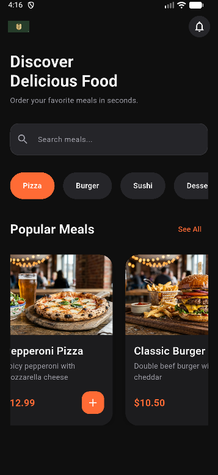

# 🍽️ Modern Restaurant Menu App UI

Modern Flutter restaurant application with
clean architecture and reusable UI components.

## ✨ Features

- Dark Theme
- Responsive Layout
- Reusable Widgets
- Modern UI
- Food Cards
- Search System
- Scalable Architecture

## 📸 Screenshots

Home Screen



## 🛠️ Tech Stack

- Flutter
- Dart
- Material 3
- Google Fonts


## 📁 Project Structure

```txt
lib/
├── core/
│   └── constants/
│
├── models/
│
├── screens/
│   └── home/
│
├── services/
│
├── theme/
│   ├── app_theme.dart
│   ├── colors.dart
│   ├── spacing.dart
│   ├── shadows.dart
│   └── text_styles.dart
│
├── utils/
│   └── responsive.dart
│
├── widgets/
│   ├── buttons/
│   ├── cards/
│   ├── common/
│   └── inputs/
│
└── main.dart
```